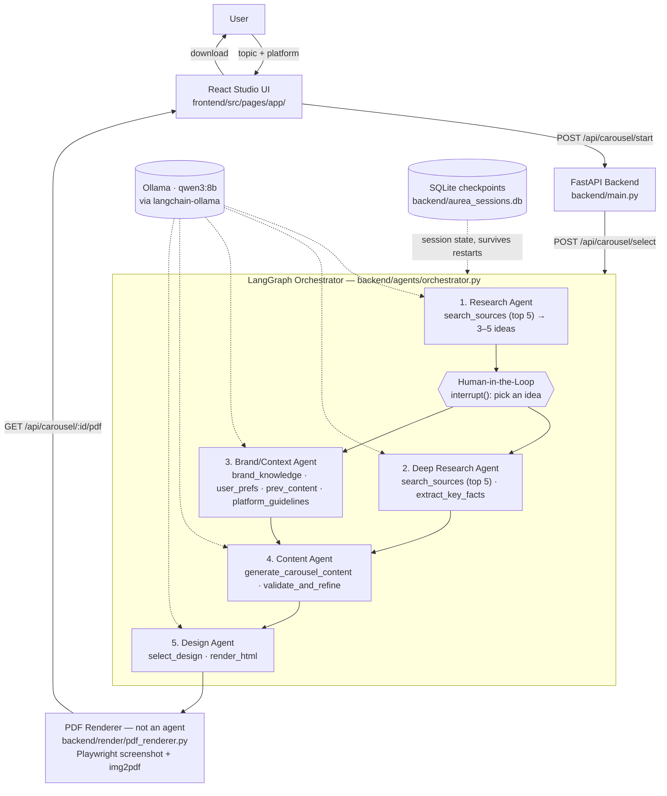

# Aurea Studio

An agentic AI content studio: describe a topic, pick a research-backed idea, and get a
platform-ready carousel/card — designed, sized, and rendered to a downloadable PDF — in
minutes. Five LangGraph agents (research, deep research, brand context, content, design)
run on a local **Ollama `qwen3:8b`** model, with one human checkpoint where you pick the
idea to run with.

## What it does

**Create**
- Researches a topic on the live web and news and proposes 3 to 5 angles; you pick one (human in the loop)
- Writes in the creator's own voice: niche, tone, audience, words to avoid, example posts, and their best-performing past posts
- Carousels (3 to 10 slides, your choice), posters, landscape images, and YouTube thumbnails
- Text formats: X threads, LinkedIn text posts, Instagram captions, newsletter blurbs, Reels or TikTok scripts (hook, beats, on-screen text), YouTube titles and descriptions
- Research sources shown in the editor, with a one-click sources slide

**Edit**
- Per-slide AI actions: rewrite, shorten, make punchier, and 3 alternative hooks
- Slide layouts: text, stat callout, list, bar chart, code, screenshot, sources; icons and background photos
- 8 templates, brand colors, uploaded fonts, saved "my templates", and several brand kits (for agencies and multi-brand creators)
- Repurpose any post into every text format; separate captions per platform (LinkedIn, Instagram, X, Threads)
- Hook score and a pre-publish checklist (readability, text density, call to action, hashtags, house style)

**Plan and publish**
- Content calendar with drag to schedule, week and month views, and an AI "plan my week"
- Ideas backlog (saved research angles, week plans, your notes) and series such as "Tip Tuesday"
- Trend watch: a scheduled research run on your niche that adds fresh ideas to the backlog
- Export PNG, ZIP, PDF, or a platform bundle (per-platform folders with images and captions); "open in X, LinkedIn, or Threads" with the text prefilled
- Insights: import post analytics (CSV) or log results; top posts feed back into the writing agent

## System Architecture



Each agent's tools live in their own file under `backend/agents/`, all sharing the
`AureaState` graph state and the same `get_llm()` client defined in `backend/llm.py`.
The pipeline fans out to the Deep Research and Brand/Context agents in parallel after
the human picks an idea, then joins before the Content agent runs.

### Platform output formats

| Platform  | Format       | Slides | Size (px)   | Default template |
|-----------|--------------|:------:|-------------|-------------------|
| LinkedIn  | Carousel     | 6      | 1080 × 1080 | Corporate         |
| Instagram | Single post  | 1      | 1080 × 1350 | Gradient          |
| X         | Card         | 1      | 1200 × 675  | Tech Blue         |

Slide count is enforced by constraining each generation call's JSON schema
(`min_length`/`max_length` on the slides array), not just by prompting — see
`_carousel_schema_for()` in `backend/agents/content_tools.py`.

## Tech stack

**Backend** — FastAPI, LangGraph, LangChain, `langchain-ollama` (Ollama `qwen3:8b`),
Playwright + img2pdf (HTML → PDF), SQLite checkpointer, `uv`.

**Frontend** — React, Vite, Tailwind CSS v4, React Router, lucide-react.

## Project structure

```
backend/
  main.py                 FastAPI app: /chat, /api/carousel/*, /api/platforms (sign-in required)
  settings.py             environment config (backend/.env, see .env.example)
  db.py, schema.sql       Postgres pool (any provider) and idempotent schema applied at startup
  api/
    auth.py               Google ID-token sign-in, cookie sessions, /api/auth/*
    profile.py            brand kit + questionnaire answers, /api/profile
    projects.py           per-user projects, /api/projects
  llm.py                  ChatOllama client (qwen3:8b, reasoning off by default for speed)
  platform_specs.py       Per-platform slide count / pixel size / default template
  agents/
    orchestrator.py       Shared state + all 5 agent nodes + graph wiring
    research_tools.py     Research Agent's tools
    deep_research_tools.py  Deep Research Agent's tools
    brand_tools.py         Brand/Context Agent's tools (static placeholder brand data)
    content_tools.py       Content Agent's tools (generate + validate/refine)
    design_tools.py        Design Agent's tools (template pick + HTML render)
    _web.py                 shared search/fetch helpers used by both research tool files
  render/
    templates.py           deterministic HTML template rendering (5 styles)
    pdf_renderer.py         Playwright screenshot + img2pdf assembly (not an agent)

frontend/
  src/
    pages/
      LandingPage.jsx       marketing page (same design system as the studio)
      auth/
        SignInPage.jsx      Continue with Google
        SignOutPage.jsx     ends the session
        OnboardingPage.jsx  first-run questionnaire: photo, logo, colors, platforms, content, tone
      app/
        LibraryPage.jsx     project library: search, filter, duplicate, delete, quick start
        CreatePage.jsx      brief -> pick an idea -> generate (live progress, cancel)
        EditorPage.jsx      slide editor: rail, live canvas, Slide/Design/Post inspector
        BrandPage.jsx       brand kit: name, handle, color, template, font, hashtags
    lib/
      templates.jsx         the 8 slide templates (one renderer for preview and export)
      export.jsx            client-side PNG / ZIP / PDF / clipboard export
      auth.js               session state, sign in / out, profile updates
      storage.js            projects (server-backed) and the brand kit
      palette.js, image.js  logo color extraction and in-browser image resizing
      text.js               house style: strips em dashes and emojis from generated copy
      api.js, sse.js        backend pipeline client (SSE progress)
    components/              app shell, slide frames, controls, and landing page sections
```

## Getting started

### Prerequisites

- Python 3.11+ and [`uv`](https://docs.astral.sh/uv/)
- Node 18+ and npm
- [Ollama](https://ollama.com) running locally with the model pulled:
  ```
  ollama pull qwen3:8b
  ```

### Accounts and database

Sign-in uses Google (free, no billing account needed), and user data lives in any
PostgreSQL database: Neon's free tier, Postgres on your own machine, or Cloud SQL.
Follow **[docs/setup.md](docs/setup.md)** to create the OAuth client and pick a database,
then copy `backend/.env.example` to `backend/.env` and fill it in.

### Backend

```bash
cd backend
uv sync
uv run playwright install chromium   # one-time, needed for PDF rendering
uv run uvicorn main:app --port 8000 --reload
```

API docs: http://localhost:8000/docs

### Frontend

```bash
cd frontend
npm install
npm run dev
```

Landing page: http://localhost:5173 | App: http://localhost:5173/app

Set `VITE_API_BASE` to point the app at a backend other than `http://localhost:8000`.

## API reference

| Method | Path                          | Body / params                     | Returns                                              |
|--------|-------------------------------|------------------------------------|-------------------------------------------------------|
| GET    | `/health`                     | —                                   | server + model status                                 |
| POST   | `/chat`                       | `{ prompt }`                        | raw model response                                     |
| GET    | `/api/platforms`              | —                                   | platform specs (slide count, size, template)          |
| POST   | `/api/carousel/start`         | `{ topic, platform, kind?, slide_count? }` | SSE stream, final `result`: `{ thread_id, platform, ideas[] }` |
| POST   | `/api/carousel/from-idea`     | `{ idea, topic, platform, kind?, slide_count? }` | `{ thread_id, ideas: [idea] }`, skips research; continue with `/select` index 0 |
| POST   | `/api/carousel/select`        | `{ thread_id, idea_index }`         | SSE stream, final `result`: `{ thread_id, platform, template, slides[], caption, hashtags[], cta, sources[] }` |
| POST   | `/api/ai/slide`               | `{ action: rewrite\|shorten\|punchier\|hooks, slide, position, project }` | `{ headline, body }` or `{ hooks[3] }` |
| POST   | `/api/ai/repurpose`           | `{ format, project }`               | `{ format, data }` for x_thread, linkedin_post, instagram_caption, newsletter, video_script, youtube |
| POST   | `/api/ai/captions`            | `{ platforms[], project }`          | `{ [platform]: { caption, hashtags[] } }` |
| POST   | `/api/ai/plan-week`           | `{ start, days, posts, notes? }`    | `{ items: [{ date, title, angle, kind }] }` |
| GET/PUT/DELETE | `/api/items/{kind}[/{id}]` | kind: idea, series, brand_kit, preset, font, metric | per-user collections; `POST /api/items/{kind}/bulk` for imports |
| GET/PUT | `/api/trends/settings`, POST `/api/trends/run` | `{ enabled, frequency, topic }` | trend watch settings; run now adds ideas to the backlog |
| *      | `/api/auth/*`, `/api/profile`, `/api/projects/*` | | Google sign-in, brand kit and voice, projects |
| GET    | `/api/carousel/{thread_id}/pdf` | —                                  | downloadable PDF                                       |

### Performance notes

Measured on an M4 / 16 GB with `qwen3:8b`: token generation (~10–19 tokens/s) is ~80% of run time, so the
pipeline minimizes generated tokens rather than tool calls.

- Research and deep research read only the **top 5 sources** (search snippets, no page scraping).
- Research proposes **3–5 ideas** (enforced by the JSON schema, not just the prompt).
- Agents call their tools directly with at most one or two LLM calls each — no LLM-driven tool loops.
- `validate_and_refine` is rule-based and only calls the LLM when a rule fails.
- Every LLM call has an output-token cap, so a runaway structured generation fails fast.
- Only one pipeline runs at a time (the local model can't serve two runs without both slowing down),
  and closing the browser tab stops the run at the next step.

### Live progress streaming

`/api/carousel/start` and `/api/carousel/select` respond with Server-Sent Events built from
LangGraph's `stream_mode="tasks"`. Each event is one JSON object: `{"type":"step","node":...,
"status":"running"|"done"}` as an agent starts/finishes, then a single `{"type":"result","data":...}`
(or `{"type":"error","message":...}`). The Studio UI renders these as a circular progress ring plus a
step timeline (`frontend/src/components/PipelineProgress.jsx`, `frontend/src/lib/sse.js`).

## Current limitations

- **No direct posting.** Publishing through the LinkedIn, X, and Instagram APIs needs an
  approved developer app on each platform. Until then Aurea exports platform bundles and
  opens each platform's composer with the text prefilled.
- **Trend watch runs while the backend runs.** The scheduler is a background thread in the
  API process; a hosted deployment should keep one instance always on (or call
  `/api/trends/run` from a cron job).
- **Sessions persist to a local SQLite file** (`backend/aurea_sessions.db`, gitignored).
  Fine for local/single-instance use; a multi-worker production deployment would need a
  shared Postgres checkpointer instead.
- **No deployment setup yet** (no Dockerfile / Cloud Run config) — local dev only for now.
