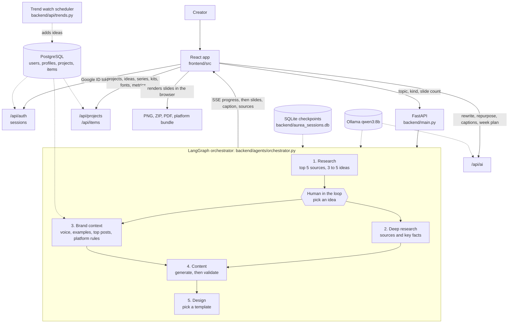

# Aurea Studio

An AI content studio for creators. Describe a topic, pick a research-backed angle, and get
carousels, posters, images, YouTube thumbnails, threads, posts, and video scripts written in
your own voice and designed in your brand. Edit everything, plan it on a calendar, and export
files ready for each platform.

Five LangGraph agents (research, deep research, brand context, content, design) run on a
local **Ollama `qwen3:8b`** model, with one human checkpoint where you choose the idea.
Accounts use Google sign-in and all user data lives in PostgreSQL.

## Features

**Create**
- Researches a topic on the live web and news and proposes 3 to 5 angles; you pick one
- Writes in the creator's voice: niche, tone, audience, words to avoid, example posts, and their best-performing past posts
- Carousels (3 to 10 slides), posters, landscape images, and YouTube thumbnails
- Text formats: X threads, LinkedIn text posts, Instagram captions, newsletter blurbs, Reels or TikTok scripts (hook, beats, on-screen text), and YouTube titles and descriptions
- Start from a fresh topic, a saved idea, or a recurring series
- Research sources shown in the editor, with a one-click sources slide

**Edit**
- Per-slide AI actions: rewrite, shorten, make punchier, and 3 alternative hooks
- Slide layouts: text, stat callout, list, bar chart, code, screenshot, and sources, plus icons and background photos
- 8 templates, brand colors, uploaded fonts, saved designs, and multiple brand kits for agencies and multi-brand creators
- Repurpose any post into every text format, and write separate captions for LinkedIn, Instagram, X, and Threads
- Hook score and a pre-publish checklist: readability, text density, call to action, hashtags, and house style
- Undo and redo, autosave, keyboard shortcuts, and a mobile layout

**Plan**
- Content calendar with week and month views, drag to schedule, and an AI "plan my week"
- Ideas backlog: saved research angles, week plans, trend finds, and your own notes
- Series for recurring formats such as "Tip Tuesday"
- Trend watch: a daily or weekly research run on your niche that adds fresh ideas to the backlog

**Publish and learn**
- Export a PNG, a ZIP of every slide, a PDF for LinkedIn document posts, or a platform bundle with images and captions for each platform
- "Open in X, LinkedIn, or Threads" with the post text filled in
- Insights: import post analytics from a CSV or log results by hand; top posts feed back into the writing agent

**House style:** generated copy never contains em dashes or emojis. Prompts ask for it, and
both the backend (`backend/text_rules.py`) and the frontend (`frontend/src/lib/text.js`)
clean anything that slips through. The editor flags any typed by hand.

## Architecture



- **One renderer for preview and export.** Slides are React components rendered at their
  native pixel size (`frontend/src/lib/templates.jsx`). The editor shows them scaled down,
  and export rasterizes the same markup in the browser, so downloads match the editor exactly.
- **Parallel agents.** After the creator picks an idea, deep research and brand context run
  in parallel, then join before the content agent writes.
- **Your voice in every call.** `brand_profile_for()` in `backend/api/profile.py` builds the
  creator's voice, words to avoid, example posts, and top-performing posts from Postgres,
  and every pipeline run and AI helper call receives it.
- **Schema-constrained output.** Slide count and idea count are enforced through each
  call's JSON schema (`min_length`/`max_length`), not just the prompt.

### Formats and sizes

| Format    | Default size | Other sizes                  | Slides  |
|-----------|--------------|------------------------------|:-------:|
| Carousel  | 1080 x 1350  | 1080 x 1080, 1080 x 1920     | 3 to 10 |
| Poster    | 1080 x 1350  | 1080 x 1080, 1080 x 1920, A4 | 1       |
| Image     | 1200 x 675   | 1080 x 1080, 1080 x 1350     | 1       |
| Thumbnail | 1280 x 720   | 1200 x 675                   | 1       |

Any visual project can switch size or add slides in the editor. Text formats (threads,
posts, scripts) are written from a researched draft, so they keep the same facts and sources.

## Tech stack

**Backend:** FastAPI, LangGraph, LangChain, `langchain-ollama` (Ollama `qwen3:8b`),
PostgreSQL via `psycopg` and `psycopg-pool`, Google ID token verification (`google-auth`),
DuckDuckGo search (`ddgs`), SQLite checkpointer for pipeline threads, `uv`.

**Frontend:** React 19, Vite, Tailwind CSS v4, React Router, lucide-react,
`html-to-image` + `jsPDF` + `JSZip` for client-side export, self-hosted fonts via Fontsource.

## Project structure

```
backend/
  main.py                FastAPI app, pipeline endpoints (SSE), router wiring
  settings.py            environment config (backend/.env, see .env.example)
  db.py, schema.sql      Postgres pool and idempotent schema applied at startup
  runtime.py             shared lock so one heavy model job runs at a time
  text_rules.py          strips em dashes and emojis from generated text
  llm.py                 ChatOllama client and schema-constrained calls with retry
  platform_specs.py      per-platform defaults used by the pipeline
  api/
    auth.py              Google sign-in, cookie sessions, dev login
    profile.py           brand kit, questionnaire answers, brand_profile_for()
    projects.py          per-user projects
    items.py             ideas, series, brand kits, saved designs, fonts, metrics
    ai.py                slide actions, repurpose, platform captions, week plan
    trends.py            trend watch settings, run now, background scheduler
  agents/
    orchestrator.py      graph state, the 5 agent nodes, and wiring
    research_tools.py, deep_research_tools.py, _web.py   web and news search
    brand_tools.py       platform rules and general writing rules
    content_tools.py     generate and validate content
    design_tools.py      template choice and server-side HTML
  render/                server-side HTML and PDF (legacy /api/carousel/{id}/pdf)

frontend/src/
  pages/
    LandingPage.jsx
    auth/                SignInPage, SignOutPage, OnboardingPage (first-run questionnaire)
    app/
      LibraryPage.jsx    projects: search, filter, quick start
      CreatePage.jsx     brief, pick an idea, generate (visual and text formats)
      EditorPage.jsx     slide editor: rail, canvas, Slide, Design, Post, Repurpose tabs
      TextEditor.jsx     editor for threads, posts, scripts, and other text formats
      CalendarPage.jsx   calendar, series, plan my week
      IdeasPage.jsx      ideas backlog and trend watch
      InsightsPage.jsx   analytics import and results
      BrandPage.jsx      brand kits, voice, fonts
  components/
    editor/              AI actions, layout fields, captions, repurpose, checklist, schedule
    AppShell, Protected, SlideFrame, SlideStack, brand, controls, Menu, Popover, Toast
  lib/
    templates.jsx        8 templates and slide layouts (one renderer for preview and export)
    export.jsx           PNG, ZIP, PDF, clipboard, and platform bundles
    api.js, sse.js       backend client and pipeline progress stream
    auth.js, storage.js, items.js, brandkits.js, fonts.js   app data
    quality.js           hook score and pre-publish checklist
    text.js, palette.js, image.js, csv.js, outputs.js       helpers

docs/
  setup.md               Google sign-in and database setup (free options included)
```

## Getting started

### Prerequisites

- Python 3.11+ and [`uv`](https://docs.astral.sh/uv/)
- Node 18+ and npm
- [Ollama](https://ollama.com) running locally with the model pulled: `ollama pull qwen3:8b`
- A Google OAuth client ID and a PostgreSQL database. Both can be free: follow
  **[docs/setup.md](docs/setup.md)** (Neon's free tier or Postgres on your own machine works).

### Configure

```bash
cp backend/.env.example backend/.env   # then fill in DATABASE_URL and GOOGLE_CLIENT_ID
```

| Setting            | Purpose |
|--------------------|---------|
| `DATABASE_URL`     | PostgreSQL connection string. Tables are created on startup. |
| `GOOGLE_CLIENT_ID` | OAuth 2.0 Web client ID used to verify Google sign-in. |
| `ALLOWED_ORIGINS`  | Comma-separated app origins allowed to call the API with cookies. |
| `COOKIE_SECURE`, `COOKIE_SAMESITE` | Session cookie settings; use `true` and `lax` behind HTTPS. |
| `DEV_LOGIN`        | Local development only: adds "Continue as local developer". Never enable in production. |

### Run

```bash
# backend
cd backend
uv sync
uv run playwright install chromium   # one-time, only for the legacy server PDF endpoint
uv run uvicorn main:app --port 8000 --reload

# frontend (another terminal)
cd frontend
npm install
npm run dev
```

- App: http://localhost:5173 (landing page) and http://localhost:5173/app
- API docs: http://localhost:8000/docs
- Health check: http://localhost:8000/health should show `"database": "ok"`

Set `VITE_API_BASE` to point the frontend at a backend other than `http://localhost:8000`.

## API reference

All `/api` routes except `/api/auth/config`, `/api/auth/google`, and `/api/auth/logout`
require a signed-in session cookie.

| Method | Path | Body | Returns |
|--------|------|------|---------|
| GET  | `/health` | | server, model, and database status |
| GET  | `/api/auth/config` | | Google client ID, database status, dev login flag |
| POST | `/api/auth/google` | `{ credential }` | sets the session cookie |
| GET  | `/api/auth/me` | | `{ user, profile: { brand, social, onboarded } }` |
| POST | `/api/auth/logout` | | clears the session |
| PUT  | `/api/profile` | `{ brand?, social?, onboarded? }` | saves the brand kit and voice |
| GET, PUT, DELETE | `/api/projects[/{id}]` | project document | the creator's projects |
| POST | `/api/carousel/start` | `{ topic, platform, kind?, slide_count? }` | SSE stream, then `{ thread_id, ideas[] }` |
| POST | `/api/carousel/from-idea` | `{ idea, topic, platform, kind?, slide_count? }` | `{ thread_id, ideas: [idea] }`; skips research |
| POST | `/api/carousel/select` | `{ thread_id, idea_index }` | SSE stream, then `{ slides[], caption, hashtags[], cta, template, sources[] }` |
| POST | `/api/ai/slide` | `{ action, slide, position, project }` | `{ headline, body }` or `{ hooks[3] }` |
| POST | `/api/ai/repurpose` | `{ format, project }` | the post in another format |
| POST | `/api/ai/captions` | `{ platforms[], project }` | a caption and hashtags per platform |
| POST | `/api/ai/plan-week` | `{ start, days, posts, notes? }` | dated post ideas |
| GET, PUT, DELETE | `/api/items/{kind}[/{id}]` | per kind | ideas, series, brand kits, saved designs, fonts, metrics |
| POST | `/api/items/{kind}/bulk` | `{ items[] }` | bulk create or update (CSV imports, week plans) |
| GET, PUT | `/api/trends/settings` | `{ enabled, frequency, topic }` | trend watch settings |
| POST | `/api/trends/run` | | runs trend watch now, returns new ideas |

### Live progress

`/api/carousel/start` and `/api/carousel/select` stream Server-Sent Events built from
LangGraph's `stream_mode="tasks"`: a `{"type":"step","node":...,"status":"running"|"done"}`
event as each agent starts and finishes, then one `{"type":"result","data":...}` or
`{"type":"error","message":...}`. The app shows them as a progress ring and step timeline.

### Performance notes

Measured on an M4 with 16 GB and `qwen3:8b`, where token generation (about 10 to 19 tokens
per second) is most of the run time:

- Research: about 35 seconds. Full generation after picking an idea: 40 to 80 seconds.
- Slide actions: 3 to 5 seconds. Repurpose, captions, and week plans: 10 to 30 seconds.
- Research reads the top 5 search results (snippets only), agents make at most one or two
  model calls each, validation only calls the model when a rule fails, and every call has
  an output token cap.
- Only one pipeline or trend run uses the model at a time; closing the tab stops a run.

## Current limitations

- **No direct posting.** Posting through the LinkedIn, X, and Instagram APIs needs an approved
  developer app on each platform. Aurea exports platform bundles and opens each platform's
  composer with the text filled in instead.
- **The model runs locally.** The backend calls Ollama on `localhost`; a hosted deployment
  needs Ollama reachable from the server or a hosted model.
- **Trend watch runs inside the API process.** Scheduled runs happen while the backend is
  running; a hosted deployment should keep one instance always on or call `/api/trends/run`
  from a cron job.
- **Pipeline threads use a local SQLite checkpointer** (`backend/aurea_sessions.db`). A
  multi-instance deployment needs a shared Postgres checkpointer.
- **No deployment config yet.** There is no Dockerfile; see the production notes in
  [docs/setup.md](docs/setup.md).
