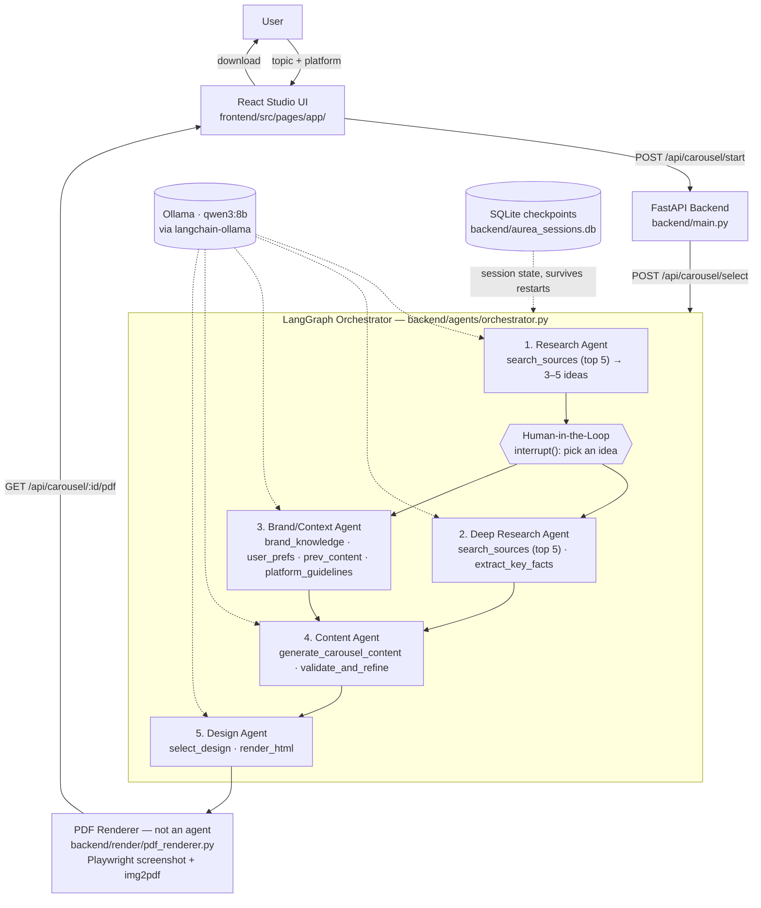

# Aurea Studio

An agentic AI content studio: describe a topic, pick a research-backed idea, and get a
platform-ready carousel/card — designed, sized, and rendered to a downloadable PDF — in
minutes. Five LangGraph agents (research, deep research, brand context, content, design)
run on a local **Ollama `qwen3:8b`** model, with one human checkpoint where you pick the
idea to run with.

## What it does

- Researches a topic on the live web/news and proposes 3–5 content ideas
- Pauses for you to pick one idea (human-in-the-loop)
- Gathers supporting facts and pulls brand/platform guidelines in parallel
- Writes platform-shaped content — a 6-slide carousel, a single Instagram post, or an X card
- Picks a visual template and renders each slide to platform-sized HTML
- Renders the HTML to a downloadable PDF, sized exactly for the target platform

## System Architecture



Each agent's tools live in their own file under `backend/agents/`, all sharing the
`AureaState` graph state and the same `get_llm()` client defined in `backend/llm.py`.
The pipeline fans out to the Deep Research and Brand/Context agents in parallel after
the human picks an idea, then joins before the Content agent runs.

### Platform output formats

| Platform  | Format       | Slides | Size (px)   | Default template |
|-----------|--------------|:------:|-------------|-------------------|
| LinkedIn  | Carousel     | 6      | 1080 × 1080 | Corporate         |
| Instagram | Single post  | 1      | 1080 × 1350 | Gradient          |
| X         | Card         | 1      | 1200 × 675  | Tech Blue         |

Slide count is enforced by constraining each generation call's JSON schema
(`min_length`/`max_length` on the slides array), not just by prompting — see
`_carousel_schema_for()` in `backend/agents/content_tools.py`.

## Tech stack

**Backend** — FastAPI, LangGraph, LangChain, `langchain-ollama` (Ollama `qwen3:8b`),
Playwright + img2pdf (HTML → PDF), SQLite checkpointer, `uv`.

**Frontend** — React, Vite, Tailwind CSS v4, React Router, lucide-react.

## Project structure

```
backend/
  main.py                 FastAPI app: /chat, /api/carousel/*, /api/platforms
  llm.py                  ChatOllama client (qwen3:8b, reasoning off by default for speed)
  platform_specs.py       Per-platform slide count / pixel size / default template
  agents/
    orchestrator.py       Shared state + all 5 agent nodes + graph wiring
    research_tools.py     Research Agent's tools
    deep_research_tools.py  Deep Research Agent's tools
    brand_tools.py         Brand/Context Agent's tools (static placeholder brand data)
    content_tools.py       Content Agent's tools (generate + validate/refine)
    design_tools.py        Design Agent's tools (template pick + HTML render)
    _web.py                 shared search/fetch helpers used by both research tool files
  render/
    templates.py           deterministic HTML template rendering (5 styles)
    pdf_renderer.py         Playwright screenshot + img2pdf assembly (not an agent)

frontend/
  src/
    pages/
      LandingPage.jsx       marketing page
      app/
        LibraryPage.jsx     project library: search, filter, duplicate, delete, quick start
        CreatePage.jsx      brief -> pick an idea -> generate (live progress, cancel)
        EditorPage.jsx      slide editor: rail, live canvas, Slide/Design/Post inspector
        BrandPage.jsx       brand kit: name, handle, color, template, font, hashtags
    lib/
      templates.jsx         the 8 slide templates (one renderer for preview and export)
      export.jsx            client-side PNG / ZIP / PDF / clipboard export
      storage.js            projects + brand kit persistence (localStorage, cross-tab sync)
      text.js               house style: strips em dashes and emojis from generated copy
      api.js, sse.js        backend pipeline client (SSE progress)
    components/              app shell, slide frames, controls, and landing page sections
```

## Getting started

### Prerequisites

- Python 3.11+ and [`uv`](https://docs.astral.sh/uv/)
- Node 18+ and npm
- [Ollama](https://ollama.com) running locally with the model pulled:
  ```
  ollama pull qwen3:8b
  ```

### Backend

```bash
cd backend
uv sync
uv run playwright install chromium   # one-time, needed for PDF rendering
uv run uvicorn main:app --port 8000 --reload
```

API docs: http://localhost:8000/docs

### Frontend

```bash
cd frontend
npm install
npm run dev
```

Landing page: http://localhost:5173 | App: http://localhost:5173/app

Set `VITE_API_BASE` to point the app at a backend other than `http://localhost:8000`.

## API reference

| Method | Path                          | Body / params                     | Returns                                              |
|--------|-------------------------------|------------------------------------|-------------------------------------------------------|
| GET    | `/health`                     | —                                   | server + model status                                 |
| POST   | `/chat`                       | `{ prompt }`                        | raw model response                                     |
| GET    | `/api/platforms`              | —                                   | platform specs (slide count, size, template)          |
| POST   | `/api/carousel/start`         | `{ topic, platform }`               | SSE stream → final `result`: `{ thread_id, platform, ideas[] }` |
| POST   | `/api/carousel/select`        | `{ thread_id, idea_index }`         | SSE stream → final `result`: `{ thread_id, platform, template, slides[], caption, hashtags[], cta }` |
| GET    | `/api/carousel/{thread_id}/pdf` | —                                  | downloadable PDF                                       |

### Performance notes

Measured on an M4 / 16 GB with `qwen3:8b`: token generation (~10–19 tokens/s) is ~80% of run time, so the
pipeline minimizes generated tokens rather than tool calls.

- Research and deep research read only the **top 5 sources** (search snippets, no page scraping).
- Research proposes **3–5 ideas** (enforced by the JSON schema, not just the prompt).
- Agents call their tools directly with at most one or two LLM calls each — no LLM-driven tool loops.
- `validate_and_refine` is rule-based and only calls the LLM when a rule fails.
- Every LLM call has an output-token cap, so a runaway structured generation fails fast.
- Only one pipeline runs at a time (the local model can't serve two runs without both slowing down),
  and closing the browser tab stops the run at the next step.

### Live progress streaming

`/api/carousel/start` and `/api/carousel/select` respond with Server-Sent Events built from
LangGraph's `stream_mode="tasks"`. Each event is one JSON object: `{"type":"step","node":...,
"status":"running"|"done"}` as an agent starts/finishes, then a single `{"type":"result","data":...}`
(or `{"type":"error","message":...}`). The Studio UI renders these as a circular progress ring plus a
step timeline (`frontend/src/components/PipelineProgress.jsx`, `frontend/src/lib/sse.js`).

## Current limitations

- **Brand knowledge is placeholder data.** `backend/agents/brand_tools.py` reads from a
  small static profile — no real vector DB or user-settings store exists yet. Swap it in
  without changing the tool signatures.
- **Sessions persist to a local SQLite file** (`backend/aurea_sessions.db`, gitignored).
  Fine for local/single-instance use; a multi-worker production deployment would need a
  shared Postgres checkpointer instead.
- **No deployment setup yet** (no Dockerfile / Cloud Run config) — local dev only for now.
